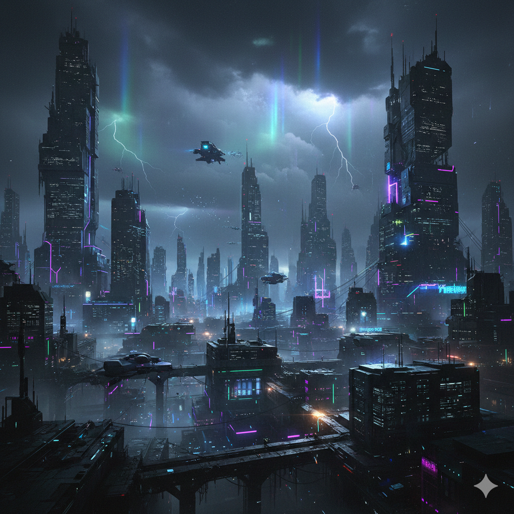

# 🕹️ Neon Arcade - Next-Gen Gaming Studio

[](https://neon-arcade-c6qjakt1r-bhargav-tanks-projects-91802618.vercel.app)
[](https://github.com/bhargav-tank)

**Live URL:** [https://neon-arcade-c6qjakt1r-bhargav-tanks-projects-91802618.vercel.app](https://neon-arcade-c6qjakt1r-bhargav-tanks-projects-91802618.vercel.app)

---

## 📸 Project Showcase



*A premium, high-performance gaming studio website showcasing "AAA" aesthetic and modern web performance.*

---

## 🚀 Tech Stack

- **Framework:** [Next.js 16 (App Router)](https://nextjs.org/)
- **Core:** React 19
- **Styling:** [Tailwind CSS v4](https://tailwindcss.com/)
- **Animations:** [Framer Motion](https://www.framer.com/motion/)
- **Icons:** [Lucide React](https://lucide.dev/)
- **State/Utility:** `clsx`, `tailwind-merge`

## ✨ Key Features

- **Immersive UI/UX:** Glassmorphism, smooth gradients, and premium micro-interactions.
- **Fluid Animations:** High-performance scroll-triggered effects via Framer Motion.
- **Responsive Design:** Pixel-perfect layout across UltraWide, Desktop, Tablet, and Mobile.
- **AAA Aesthetic:** Dark mode optimized with high-contrast neon accents.

## 🛠️ Quick Start

```bash
# Install dependencies
npm install

# Run locally
npm run dev
```

---

Built with ❤️ for the future of gaming.
